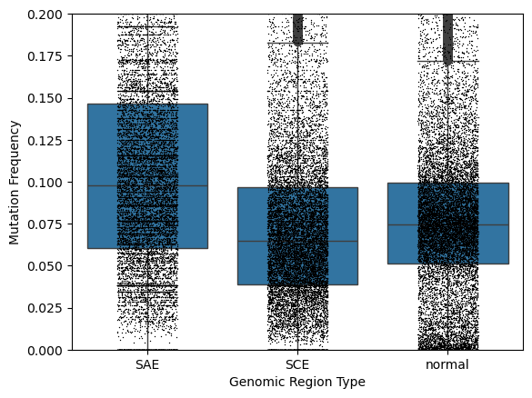
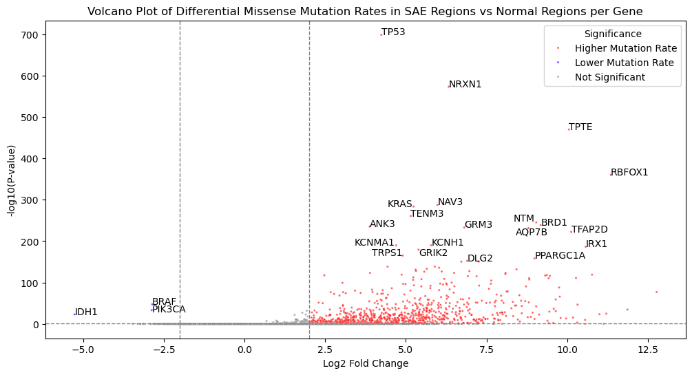
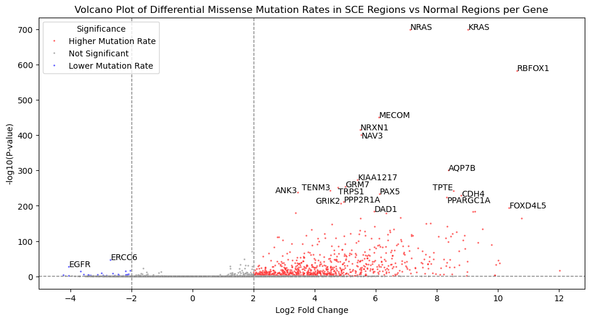
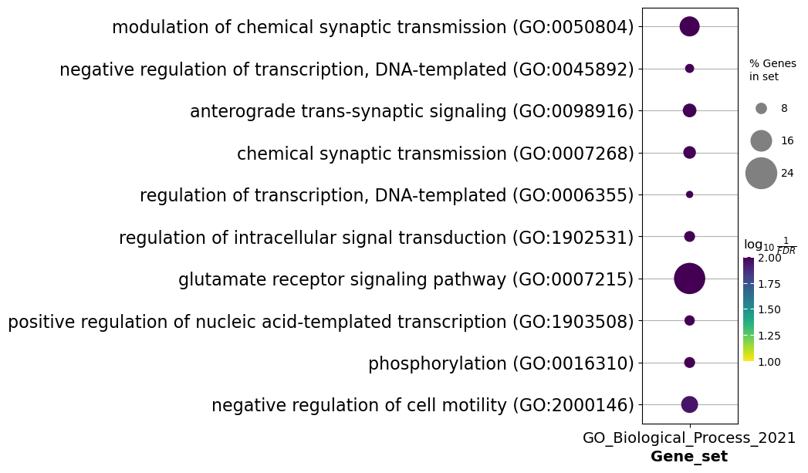
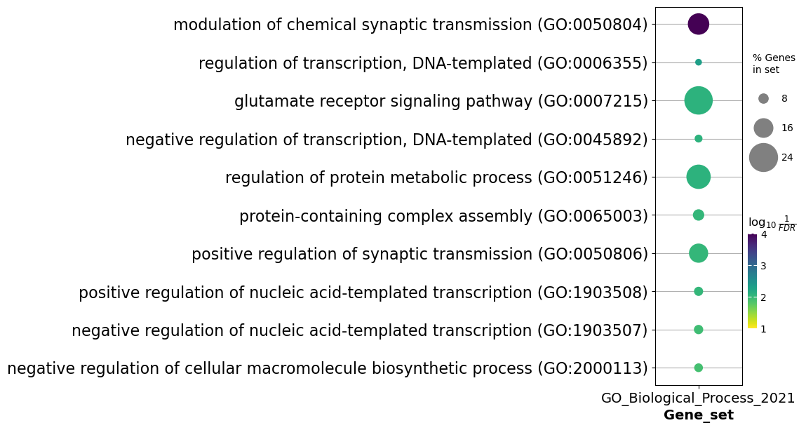

# Analysis of Short-Term Mutational Pressures within Cancer in the Context of Long-Term Mammalian Evolution

**Author:** Paulo Miguel | **Supervisor:** Prof. Max Wolf | **Course:** BINF7700, Northeastern University

## Overview

This project asks whether tumor mutations occur preferentially in genomic regions defined by long-term evolutionary constraint: synonymous constraint elements (SCEs) (regions where synonymous substitutions are rarer than expected over evolutionary time) and synonymous acceleration elements (SAEs) (regions where synonymous substitutions are more frequent than expected). The core idea is to treat cancer as a form of fast, short-timescale "somatic evolution" and ask whether it respects the same constraints seen in slow, germline evolution — or breaks from them.

Using 18,497 MAF files (3,144,235 filtered SNPs) from the NCI GDC Data Portal, the project found 941 genes with differential mutation rates in SCE regions and 1,031 genes in SAE regions relative to normal regions of the same gene, with 585 genes significant in both — suggesting cancer mutation is non-random and that SAEs/SCEs may mark distinct stages of tumor evolution.

## Methods

### 1. Cancer mutation data preparation
- Ideal data (raw BAM alignments from tumor vs. matched healthy tissue) was inaccessible within the project timeline due to controlled-access requirements at NCI GDC and ICGC ARGO.
- Instead, 18,497 open-access MAF files (whole-exome sequencing) were pulled via the GDC API and organized by tumor type.
- Filtering kept only single nucleotide polymorphisms (SNPs) and removed non-coding calls (3'UTR, 5'Flank, intronic). This dropped the raw 3,875,965 mutations to 3,144,235 SNPs (731,730 removed, mostly frameshift/in-frame indels or non-exonic variants).
- Every retained mutation was validated against the **hg38** reference genome using Deep Genomics' **GenomeKit** package, carefully reconciling MAF's 1-indexed coordinates with GenomeKit's 0-indexed intervals. No mutations failed this validation step.

### 2. SAE/SCE reference dataset construction
- Built from the Consensus Coding Sequence (CCDS) dataset (downloaded 2025/10/22), with withdrawn CCDS IDs removed and overlapping/alternative-splicing intervals consolidated into single genomic rows.
- SAE and SCE genomic intervals (from UCSC Genome Browser, based on FRESCo analysis across 29 mammalian genomes) were overlaid onto the CCDS regions, classifying every coding interval as **SAE**, **SCE**, or **normal**. Region lengths were computed for rate normalization.

### 3. Mutation counting
- For each gene-region combination, missense (amino-acid-changing) and silent (synonymous) SNPs were counted separately and converted to per-base mutation rates.
- Of 3,144,235 SNPs, 3,130,878 (99.57%) matched a region in the SAE/SCE CCDS dataset; unmatched mutations were mostly attributable to genes withdrawn from or absent from CCDS.

### 4. Differential mutation rate testing
- Mutations were modeled as independent Bernoulli trials (justified because >99% of samples had <2,000 mutations against a backdrop of ~151 million coding nucleotides), enabling a binomial test per gene-region comparison.
- Null hypothesis: mutation probability is uniform across a gene, so the expected probability = (SAE or SCE length) / (SAE-or-SCE length + normal length) for that gene.
- Observed probability: actual mutation count in the SAE/SCE region relative to total mutations in that region + the gene's normal region.
- 29,569 binomial tests were run in total (13,381 SAE-normal + 16,188 SCE-normal comparisons), with significance determined using α = 0.05 after Bonferroni correction.

### 5. Over-representation analysis (ORA)
- Statistically significant genes (ranked by corrected p-value) were run through `gseapy`'s `enrichr` wrapper against the **GO Biological Processes 2021** database to identify enriched functional categories.

### 6. Individual-region spot check
- For three genes highly significant in *both* SAE and SCE comparisons (TPTE, NRXN1, TENM3), each individual SAE/SCE sub-region was tested separately to see whether elevated mutation was spread across the gene or concentrated in a few regions.

## Key Results 

- SAE regions show a higher mutation frequency than both normal and SCE regions; unexpectedly, SCE regions were *less* constrained than predicted in many genes.

<p align="center">
    
</p>

*Figure 1. Mutation frequencies across SAE, SCE, and normal regions for genes containing at least one of each (n = 12,601).*

- 1,031/13,381 (7.70%) genes were significant for SAE-normal comparisons and 941/16,188 (5.81%) for SCE-normal comparisons — almost all showing *higher* mutation in SAE/SCE vs. normal (only IDH1, BRAF, PIK3CA were significantly under-mutated in SAE; 36 genes including EGFR, ERCC6, CTCFL were under-mutated in SCE).

<p align="center">
    
</p>

*Figure 2. Differential mutation rate, SAE vs. normal regions, per gene.*

<p align="center">
    
</p>

*Figure 3. Differential mutation rate, SCE vs. normal regions, per gene.*

- **585 genes** were significant in both comparisons (57.6% of SAE hits, 61.2% of SCE hits), and ORA showed both gene sets are enriched for regulatory biological processes (transcriptional regulation, glutamate receptor signaling, synaptic transmission), pathways with known links to cancer.

<p align="center">
    
</p>

*Figure 4. Top enriched GO Biological Process terms for genes over-mutated in SAE regions.*

<p align="center">
    
</p>

*Figure 5. Top enriched GO Biological Process terms for genes over-mutated in SCE regions.*

- Region-level spot checks showed **NRXN1** and **TENM3** had elevated mutation spread across nearly all of their SAE/SCE sub-regions (86–95% of SAEs, 51–70% of SCEs significant), while **TPTE** showed the opposite pattern — mutation concentrated in only a few sub-regions (20% of SAEs, 7% of SCEs), with most sub-regions carrying no mutations at all.

## Discussion

### Interpretation
The results suggest that a subset of cancer-associated genes undergo a loss of the selective pressures normally observed over evolutionary timescales. Many of the 585 genes significant in both SAE and SCE comparisons are established cancer drivers (TP53, KRAS, PIK3CA, ARID1A, APC, BRAF, DCC), and the ORA results tie these genes to regulatory functions (cell growth, division, DNA repair).

The proposed model has two stages:
1. "Trunk" mutations (early, driver-defining alterations) are theorized to be over-represented in SCE regions, since mutations there are more likely to be functionally disruptive.
2. Once a driver gene is disrupted, the tumor lineage shifts into a "branch" phase governed more by genetic drift/neutral selection than fitness. Because SAE regions are, by definition, regions where non-synonymous substitution has historically accelerated (i.e., they tolerate change more easily), they may accumulate mutation preferentially during this neutral phase.

An alternative (non-competing) explanation: driver genes may simply enter a "disrupted" mutational state earlier in tumor evolution and therefore have more time to accumulate mutations, which would explain elevated SAE rates concentrating in driver/disrupted genes rather than genes broadly.

The TPTE spot-check complicates this picture: not all SAE regions within a gene behave the same way, hinting that there may be two functionally distinct SAE subtypes, high-non-synonymous-rate SAEs (likely low functional constraint) vs. low-non-synonymous-rate SAEs (likely functionally important, more constrained), that respond differently under cancer's altered selective regime.

### Limitations
1. **Version mismatch** between the CCDS release used for mutation mapping and the one originally used to define SAE/SCE coordinates, and SAE/SCE calls being based on a non-exhaustive 29-species alignment, could subtly bias region boundaries and mutation counts.
2. **Data scope**: restricting to SNPs (dropping ~700K non-SNP mutations) and using only the 18,497 open-access MAF files (vs. 104,064 controlled-access samples) simplified the analysis but limits statistical power for cancer-type-specific questions. ~162 mutations/gene on average was enough to detect pooled significance but did not allow for extending the analysis to individual cancer types.
3. **Independence assumption**: the binomial/Bernoulli model assumes mutations within a sample are independent, this may hold true in certain case, but it is more likely that there are processes at hand leading to co-occurring mutation patterns which would violate independence.

### Future directions
- Use controlled-access GDC data plus transcriptomic data to test whether SAE/SCE mutation enrichment tracks with gene activity in the tumor's tissue of origin, and to stratify by cancer type.
- Analyze individual SAE/SCE sub-regions (rather than whole-gene aggregates) to pinpoint which specific elements drive the signal and to separate the two hypothesized SAE subtypes.

## Dependencies

All environment dependencies for this analysis can be found in the environment.yml file in the repository. The dependencies are as follows:

* python=3.12.1
* numpy=2.3.5
* pandas=2.3.3
* genomekit=7.2.2
* sh=2.2.2
* jupyter=1.1.1
* matplotlib=3.10.8
* seaborn=0.13.2
* scipy=1.16.3
* statsmodels=0.14.5
* gseapy=1.1.11
* adjusttext=1.3.0
* dna_features_viewer

Installation of the dependencies using the environment.yml file requires conda. Run the below command to create the conda environment.

```
conda env create -f environment.yml
```

## Data

### Availability of Raw Reference Files

NOTE: The raw files used in this analysis have been provided in this directory. They can be found zipped in `ref_data/raw.zip`.

The location and date of download of all the reference files used in this analysis can be found below:

Consensus CDS (CCDS) file: 
* Downloaded on 2025/10/22 from https://ftp.ncbi.nih.gov/pub/CCDS/current_human/
* CCDS.current.txt file was downloaded
* Date of last modification of file on download date was 2025/09/28 at 13:12

Synonymous Constraint Element file:
* Downloaded on 2025/10/16 from https://genome.ucsc.edu/cgi-bin/hgTables?db=hg38&hgta_group=hub_377623&hgta_track=hub_377623_SCE&hgta_table=hub_377623_SCE&hgta_doSchema=describe+table+schema

Synonymous Acceleration Element file:
* Downloaded on 2025/10/16 from https://genome.ucsc.edu/cgi-bin/hgTables?db=hg38&hgta_group=hub_377623&hgta_track=hub_377623_SAE&hgta_table=hub_377623_SAE&hgta_doSchema=describe+table+schema

### Modification of Raw Reference Files

NOTE: The modified files used in this analysis have been provided in this directory. They can be found zipped in `ref_data/modified.zip`.

The modified files used in this analysis were generated using the `prep_ref_files.py` script which can be found in the `scripts/` folder of this repository. To run the scipt, go to root file of the repository and run `prep_ref_files.py`.

```
python scripts/prep_ref_files.py
```

### Downloading Mutation Data

The mutation data used in this analysis were sourced from the National Cancer Institute GDC Data Portal (https://portal.gdc.cancer.gov/). To download the files locally, the `maf_downloader.py` script was created. It can be ran using the following command.

```
python scripts/count_mutations.py -n [number of files] -l [logfile name]
```

NOTE: This script has not yet been modified to recognize which files have already been downloaded to the repository and download other undownloaded files. To get all open access WXS MAF files on the GDC Data Portal, use -n 20000. Ideally, use screen or sbatch, since the download will take 8+ hours.

### Mutation Validation

All mutation data downloaded used in this analysis was verified, by checking if the reference allele in the files matched HG38, and filtered, keeping only the silent (synonymous) and missense (non-synonymous) single nucleotide polymorphisms (SNP). Following the above step of downloading the mutation files, this step can be completed using the `validate_mutations.py` script. It can be ran using the following command.

```
python scripts/validate_mutations.py
```

## Analysis

The notebooks folder includes several Jupyter notebooks used for various analyses. They are are follows:

### analysis.ipynb

This Jupyter notebook contains exploratory analyses into the count data, hypothesis testing on the mutation distributions in the genes and over-representation analysis (ORA) on the statistically significant genes.

### gene_distributions.ipynb

This Jupyter notebook contains visualizations of the mutation rate over the length of individual genes. It is used to visualize and determine qualitatively which regions of a gene have higher or lower mutation rates.

### not_matched.ipynb

This Jupyter notebook contains an analysis on the mutations that did not match the CCDS regions from the raw files. 

### sample_dist.ipynb

This Jupyter notebook contains the creating of a visualization for the number of mutations found in each of the analyzed samples.

## License

See the [LICENSE](LICENSE) file